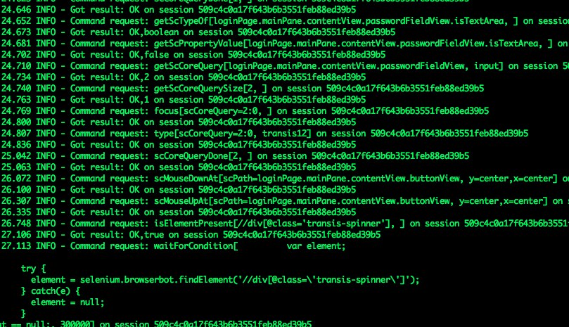
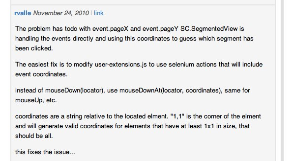

!SLIDE
# Quick Survey

!SLIDE 
# Lebowski:
## A SproutCore Testing Framework

!SLIDE 
# Disclaimers:

!SLIDE center
* 
* 

!SLIDE bullets
* Not A JS Developer
* SC & Lebowski are both under heavy development

!SLIDE bullets incremental
# What is Lebowski?
* Full-Stack Testing Framework
* Ruby Object Layer
* Built on top of selenium-client
* <tt>gem install lebowski</tt>

!SLIDE bullets incremental
# When to Use Lebowski
* Your interactions are stable
* You actually have time to invest
* An automated regression suite provides value

!SLIDE smbullets incremental
# Tools
* Firebug / Chrome Developer Tool
* [https://addons.mozilla.org/en-US/firefox/addon/sproutcore-pathpicker](https://addons.mozilla.org/en-US/firefox/addon/sproutcore-pathpicker)
* Cucumber, RSpec, minitest, etc.
* Your source code

!SLIDE bullets incremental
# _"Ve vant ze money, Lebowski"_
* Drag n' Drop
* Complex interactions
* SC layerID

!SLIDE center
* 

!SLIDE smaller
# Still need standard AJAX tricks
    @@@ ruby
    def wait_for_no_spinner
      spinner = "//div[@class='transis-spinner']"
      app.driver.wait_for_no_element spinner if agent.element? spinner
    end

    def wait_for_not_saving
      saving = "//label[contains(text(), 'Saving ...')]"
      app.driver.wait_for_no_element saving if agent.element? saving
    end

!SLIDE code smaller

    @@@ cucumber
    Feature: Submitting an IO
    
      Scenario: Acceptance of an IO with no modifications
        Given I have a submitted a simple RFP to a tribune publisher
        When I log in to PCT2 as a production publisher
        And I review the submitted RFP  
        When I click the button 'Submit Placements'
        ...

!SLIDE
# An now an offering to the demo gods...

!SLIDE bullets incremental
# _"This is what happens when you find a stranger in the alps!"_
* GridView
* Custom Views
* Sometimes need to drop into the selenium driver directly :-(

!SLIDE code
    @@@ ruby
    def fcuking_click_at(sel, pos = 0)
      agent.mouse_down_at sel, 0
      agent.mouse_up_at sel, 0
    end

!SLIDE center
* 

!SLIDE bullets incremental
# _"Yeah, well, that's just, like, your opinion, man."_
* Leverage VMs
* Headless & Parallel via Xvfb, Hydra, etc.

!SLIDE bullets incremental
# Future
* SC Updates
* Selenium 2 and Firefox 4

!SLIDE bullets incremental
* Testing framework by @frozencanuck
* Under active development
* Generally works well, excellent documentation
* Sometimes have to break abstraction
* Lots to do

!SLIDE bullets incremental
# Thanks!
* Jeffrey O'Dell, @umsondo
* [http://github.com/frozencanuck/lebowski](http://github.com/frozencanuck/lebowski)
* [http://lebowski-chi-sproutcore.heroku.com](http://lebowski-chi-sproutcore.heroku.com)
